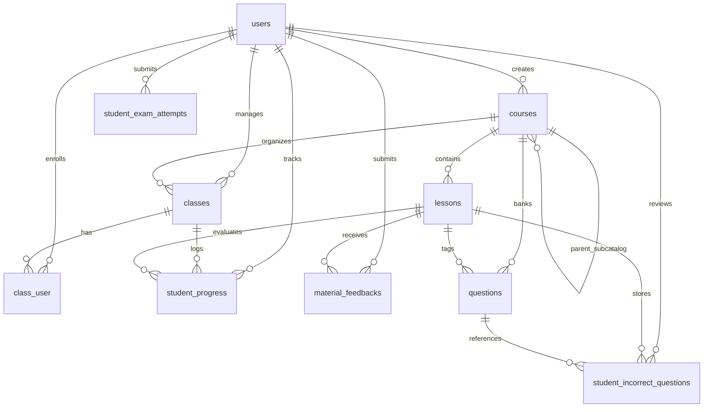

# Buddhist Courses Platform

A comprehensive Buddhist education and course management platform.

The platform enforces a strict **5-step sequential learning progression** for students and provides robust **class and curriculum management** for instructors and administrators.

---

## 1. System Architecture & Tech Stack

- **Backend**: Laravel 11 (PHP 8.3)
- **Frontend**: React 19, Inertia.js 3 (`@inertiajs/react`), TypeScript 5, Vite 5
- **Rich Text Editor**: TipTap (`@tiptap/react` + starter-kit)
- **Styling**: Tailwind CSS 3.4 (`@tailwindcss/forms`, `@tailwindcss/typography`), Sass, Headless UI, Heroicons
- **Database**: MySQL 8.0 (with SQLite in-memory support for testing)
- **Authentication**: Session-based authentication supporting standard `username` and `email` credentials, password reset, email verification, social OAuth integration (Google & Facebook via Socialite), and Role-Based Access Control (`role:admin,teacher` vs. `student`). Initial setup wizard (`/setup`) enables creating the initial administrator account.

---

## 2. Academic Curriculum Structure

Will be updated by Administrator & Teacher

---

## 3. Core Business Logics & Workflows

### A. Authentication & User Access
- **Multi-Attribute Login**: Supports login using either `username` or `email` along with password.
- **Initial Setup Wizard (`/setup`)**: Automatically accessible when no administrator account exists in the database to provision the initial superadmin.
- **Social Authentication**: OAuth integration with Google and Facebook (`/auth/{provider}` and `/auth/{provider}/callback`).
- **Role-Based Redirection (`/dashboard`)**:
  - `admin` or `teacher` $\rightarrow$ Redirected to `/admin/dashboard`.
  - `student` $\rightarrow$ Redirected to `/student/dashboard`.

### B. Class Manager & Teacher Portal (`/admin/...`)
1. **Class Management (`/admin/dashboard`, `/admin/classes/{id}`)**:
   - **Class Overview**: Displays associated course/category, assigned instructor in charge, total enrolled students, completed student count, average completion rate across lessons, and lock status.
   - **Class Lock / Unlock**: Instructors and administrators can lock or unlock any class to control student progression. Locked classes prevent students from accessing lessons or advancing.
   - **Roster & Progress Tracking**: Enroll students into classes by username/ID or remove them. View detailed per-student progress tables across all lessons and the 5-step learning pipeline.
   - **Class Lifecycle**: Create, update, and delete classes linked to curriculum courses.
2. **Materials & Curriculum Management (`/admin/materials`)**:
   - **Hierarchical Course Catalogs**: Create, update, and delete courses and sub-catalogs (`parent_id`, ordering, category, description, assigned user/instructor).
   - **Lesson Management**: Create and edit lesson materials with rich text content (TipTap editor), multiple reference document links (`document_urls`), and multiple lecture video links (`video_urls`).
   - **Student Feedback Inbox**: Displays error reports and typo corrections submitted by learners directly beneath reading materials. Instructors can mark reports as `pending`, `reviewed`, or `resolved` and record administrator notes.
3. **Question Bank Management (`/admin/questions`)**:
   - Manage multiple-choice questions (Options A, B, C, D) categorized by course and optional lesson association.
   - Includes designated correct option (`A`, `B`, `C`, `D`), doctrinal scripture explanations, and question type (`practice`, `exam`, `both`).
4. **User & Account Management (`/admin/users`)**:
   - Administrators manage user accounts (Students, Teachers, Admins) with Name, Username, Email, Phone, and Status (`active`, `suspended`).
   - Search across users, filter by role, create new accounts, update details, reset passwords, or delete accounts.

### C. Student Portal & Strict 5-Step Learning Pipeline (`/student/...`)

Every lesson unit enforces a strict sequential progression gate. A student cannot skip steps:

```
[ Step 1: Self-Study Reading ]
              │
              ▼ (Requires student confirmation)
[ Step 2: Lecture Video Clip ]
              │
              ▼ (Requires student confirmation)
[ Step 3: Practice & Review Quiz (10 Repetitions) ]
              │
              ▼ (Requires practice_count >= 10)
[ Step 4: Final Examination (Automatic grading & error logging) ]
              │
              ▼ (Unresolved incorrect answers remain)
[ Step 5: Master Incorrect Questions ]
              │
              ▼ (When unresolved incorrect count == 0)
     ★ LESSON PROGRAM COMPLETED ★
```

#### Step 1: Self-Study Reading Material
- Student reads assigned doctrinal notes and accesses attached reference documents or PDFs.
- **Feedback Feature**: Allows students to submit corrections, typos, or doctrinal questions directly to the instructor.
- Action: Student clicks **"Confirm Reading Completed"** $\rightarrow$ Sets `reading_completed = true` and `reading_completed_at = now()`, unlocking Step 2.

#### Step 2: Lecture Video Clip
- Embedded video player clarifying the self-study text.
- Locked until Step 1 is marked as completed.
- Action: Student clicks **"Confirm Video Completed"** $\rightarrow$ Sets `video_completed = true` and `video_completed_at = now()`, unlocking Step 3.

#### Step 3: Practice & Review Quiz
- Interactive multiple-choice questions loaded dynamically with shuffled options.
- **Instant Feedback**: When the student selects an option, the system immediately returns whether it is correct or incorrect along with the canonical explanation.
- **Mandatory 10-Repetition Requirement**: Monastic guidelines mandate repeating the practice quiz **10 times** for thorough retention.
- Real-time progress counter: `practice_count / 10`.
- When `practice_count >= 10`, sets `practice_completed = true` and `practice_completed_at = now()`, unlocking Step 4.

#### Step 4: Final Examination
- Exam questions randomized and evaluated upon submission.
- **Concluding Test Summary**:
  - **Correct Answers Count**
  - **Incorrect Answers Count**
  - **Review Needed Count**
  - **Exam Score Percentage**
- **Automatic Error Logging**: All incorrect answers are recorded in `student_incorrect_questions` with `is_resolved = false`.
- If 0 incorrect questions exist on the exam, the lesson is immediately marked complete (`is_completed = true`). Otherwise, Step 5 is required.

#### Step 5: Master Incorrect Questions
- Dedicated mastery room showing all unresolved incorrect questions from the examination.
- Student re-attempts each missed question with immediate feedback and explanation.
- Selecting the correct option marks `is_resolved = true` and `resolved_at = now()`.
- **Lesson Completion Condition**: The lesson is **ONLY marked as Completed (`is_completed = true`) when 0 unresolved incorrect questions remain**.
- **Class Completion Condition**: When all lessons in a class are completed, the student's class enrollment status is marked as `completed` with their final grade.

---

## 4. Database Schema Reference



### Table Details
1. `users`: `id`, `username` (string, unique), `name`, `email`, `password`, `role` (`admin`|`teacher`|`student`), `phone`, `status` (`active`|`suspended`), `provider`, `provider_id`, `avatar`, `email_verified_at`, `remember_token`, timestamps.
2. `courses`: `id`, `parent_id` (foreign key to `courses.id`, nullable), `user_id` (foreign key to `users.id`, nullable), `title`, `slug`, `category` (`dhamma`|`vinaya`|`abhidhamma`|`pali`), `target_audience`, `description`, `order`, timestamps.
3. `classes`: `id`, `course_id` (foreign key to `courses.id`), `user_id` (foreign key to `users.id`), `name`, `description`, `is_locked` (boolean), timestamps.
4. `class_user` (pivot): `id`, `class_id`, `user_id`, `enrolled_at`, `status` (`enrolled`|`completed`|`dropped`), `final_grade`, `completed_at`, timestamps.
5. `lessons`: `id`, `course_id`, `title`, `slug`, `order`, `summary`, `reading_content`, `reading_file_url`, `document_urls` (JSON), `video_url`, `video_urls` (JSON), timestamps.
6. `questions`: `id`, `course_id`, `lesson_id` (nullable), `question_text`, `option_a`, `option_b`, `option_c`, `option_d`, `correct_option` (`A`|`B`|`C`|`D`), `explanation`, `type` (`practice`|`exam`|`both`), timestamps.
7. `student_progress`: `id`, `user_id`, `class_id`, `lesson_id`, `reading_completed`, `reading_completed_at`, `video_completed`, `video_completed_at`, `practice_count` (integer 0–10), `practice_completed`, `practice_completed_at`, `exam_completed`, `exam_completed_at`, `exam_score`, `is_completed`, `completed_at`, timestamps.
8. `student_exam_attempts`: `id`, `user_id`, `class_id`, `course_id`, `attempt_type` (`exam`), `total_questions`, `correct_count`, `incorrect_count`, `review_needed_count`, `score`, `answers_summary` (JSON with `{'quiz':{},'essay':{}}`), timestamps.
9. `student_incorrect_questions`: `id`, `user_id`, `class_id`, `lesson_id`, `question_id`, `last_chosen_option`, `is_resolved` (boolean), `resolved_at`, timestamps.
10. `material_feedbacks`: `id`, `lesson_id`, `user_id`, `content`, `status` (`pending`|`reviewed`|`resolved`), `admin_notes`, timestamps.

---

## 5. Web Routes & API Endpoints

### Public & Auth Routes
- `GET /`: Public landing page (displays course catalog, active classes, monastery information, and login access).
- `GET /setup` | `POST /setup`: Initial administrator setup wizard (active only when no admin exists).
- `GET /login` | `POST /login`: Username or Email login.
- `GET /register` | `POST /register`: Student account registration.
- `GET /auth/{provider}` | `GET /auth/{provider}/callback`: Social OAuth login (Google, Facebook).
- `GET /forgot-password` | `POST /forgot-password` | `GET /reset-password/{token}` | `POST /reset-password`: Password reset flows.
- `POST /logout`: Sign out.
- `GET /dashboard`: Role-based redirector (`admin`/`teacher` $\rightarrow$ `/admin/dashboard`; `student` $\rightarrow$ `/student/dashboard`).

### Admin & Teacher Routes (`middleware: auth, role:admin,teacher`)
- `GET /admin/dashboard`: Class management dashboard with overview statistics and class cards.
- `GET /admin/classes/{id}`: Detailed class roster, individual student progress table, and enrollment controls.
- `POST /admin/classes`: Create a new class.
- `PUT /admin/classes/{id}`: Update class information.
- `POST /admin/classes/{id}/toggle-lock`: Toggle class lock status (lock/unlock to regulate student access).
- `POST /admin/classes/{id}/students`: Enroll a student into a class by ID or username.
- `DELETE /admin/classes/{id}/students/{userId}`: Remove a student from a class roster.
- `DELETE /admin/classes/{id}`: Delete a class.
- `GET /admin/materials`: Manage reading materials, lecture videos, and student feedback.
- `POST /admin/materials`: Create new lesson with reading content and video links.
- `PUT /admin/materials/{id}`: Update lesson details and materials.
- `DELETE /admin/materials/{id}`: Delete lesson.
- `POST /admin/materials/catalogs`: Create a new course catalog or sub-catalog.
- `PUT /admin/materials/catalogs/{id}`: Update course catalog details.
- `DELETE /admin/materials/catalogs/{id}`: Delete course catalog.
- `PUT /admin/feedbacks/{id}`: Update student feedback report status (`pending` $\rightarrow$ `reviewed` / `resolved`) and admin notes.
- `GET /admin/questions`: View question bank (filterable by course).
- `POST /admin/questions`: Create a multiple-choice question.
- `PUT /admin/questions/{id}`: Update question.
- `DELETE /admin/questions/{id}`: Delete question.
- `GET /admin/users`: User management list (search, filter by role: `admin`, `teacher`, `student`, view enrolled classes).
- `POST /admin/users`: Create a user account.
- `PUT /admin/users/{id}`: Update user account details.
- `PUT /admin/users/{id}/password`: Reset/update user password.
- `DELETE /admin/users/{id}`: Delete user account.

### Authenticated Profile Routes (`middleware: auth`)
- `GET /admin/profile/edit`: Edit profile page.
- `PATCH /admin/profile`: Update profile information.
- `DELETE /admin/profile`: Delete user profile account.

### Student Routes (`middleware: auth`)
- `GET /student/dashboard`: Student classes overview and progression roadmap.
- `GET /student/classes/{classId}/lessons/{lessonId}`: 5-step lesson player.
- `POST /student/classes/{classId}/lessons/{lessonId}/reading-complete`: Complete Step 1 (unblocks Step 2).
- `POST /student/classes/{classId}/lessons/{lessonId}/video-complete`: Complete Step 2 (unblocks Step 3).
- `POST /student/classes/{classId}/lessons/{lessonId}/feedback`: Submit reading material correction or question to the instructor.
- `POST /student/classes/{classId}/lessons/{lessonId}/practice-check`: Validate practice question answer and return immediate result with explanation.
- `POST /student/classes/{classId}/lessons/{lessonId}/practice-record`: Increment practice review counter toward the 10-repetition requirement.
- `POST /student/classes/{classId}/lessons/{lessonId}/exam-submit`: Grade final exam, log missed questions for mastery, and return test summary.
- `POST /student/classes/{classId}/lessons/{lessonId}/incorrect-retry`: Retest missed questions. When all missed questions are resolved, marks lesson and class as complete.

---

## 6. Setup & Execution Guide

### 1. Environment & Dependencies
```bash
cp .env.example .env
composer install
npm install
php artisan key:generate
```

### 2. Database Migrations & Seeding
```bash
# Run migrations
php artisan migrate

# Optional: Seed demo data
php artisan db:seed --class=DemoUserSeeder
```

### 3. Run Development Servers
```bash
# Using local launch script:
./start.local

# Or manually in separate terminals:
php artisan serve
npm run dev
```

### 4. Running Automated Tests & Build Verification
```bash
# Run backend PHPUnit test suite:
php artisan test

# Verify frontend TypeScript compilation & build:
npm run build
```
