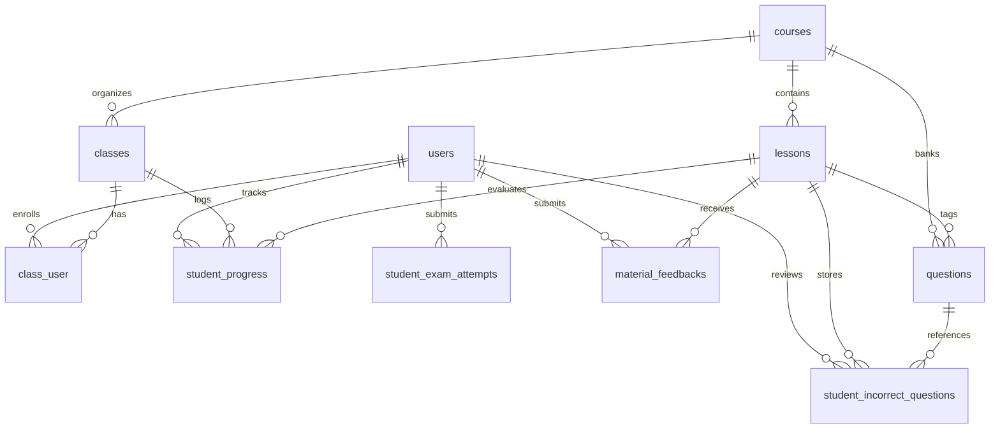

# Viên Không Ni – Buddhist Courses Platform

A comprehensive Buddhist education and course management platform built for **Tu Viện Viên Không Ni** (*Viên Không Ni Buddhist Monastery*), situated in Ấp 4, Xã Châu Pha, Tp. Hồ Chí Minh (Facebook: [Tu Viện Viên Không Ni](https://www.facebook.com/share/1DCWqsCZSY/?mibextid=wwXIfr)).

The platform enforces a strict **5-step sequential learning progression** for students and provides robust **cohort lifecycle management** for monastery instructors and administrators.

---

## 1. System Architecture & Tech Stack

- **Backend**: Laravel 10 (PHP 8.3)
- **Frontend**: React 19, Inertia.js 3, TypeScript 5, Vite 5
- **Styling**: Tailwind CSS, SCSS, Headless UI, Heroicons
- **Database**: MySQL 8.0 (with SQLite in-memory support for testing)
- **Authentication**: Session-based auth supporting standard username and email credentials with role-based access control (`role:admin,teacher` vs. `student`).

---

## 2. Academic Curriculum Structure

Pre-seeded into 4 core Buddhist academic divisions as defined by monastic guidelines:

| Division | Code / Category | Subjects & Scope | Target Audience |
| :--- | :--- | :--- | :--- |
| **1. Dhamma (*Pháp*)** | `dhamma` | &bull; **Pháp học tinh yếu**: Four Noble Truths, Eightfold Path, Dependent Origination.<br>&bull; **Pháp học theo kinh tạng**: Sutta Pitaka discourses (Digha, Majjhima, Samyutta, Anguttara). | All |
| **2. Vinaya (*Luật*)** | `vinaya` | &bull; **Tỳ Kheo Ni**: 311 Bhikkhuni Patimokkha rules.<br>&bull; **Sa-di / Sa-di-ni**: 10 Novice Precepts and Sekhiya protocols.<br>&bull; **Tu nữ**: 8 Precepts and monastic deportment for female renunciants.<br>&bull; **Cư sĩ**: 5 Precepts and 8 Uposatha Precepts for lay followers. | Monastics & Lay |
| **3. Abhidhamma (*Vi Diệu Pháp*)** | `abhidhamma` | &bull; **Thắng pháp tập yếu luận (*Abhidhammattha-sangaha*)**: Ultimate realities: Citta (Consciousness), Cetasika (Mental Factors), Rupa (Matter), Nibbana. | All |
| **4. Pali (*Pali ngữ*)** | `pali` | &bull; **Cách phát âm**: Phonetics, vowels, consonants, chanting cadences.<br>&bull; **Văn phạm Pali**: Declensions, conjugations, sandhi, prefixes.<br>&bull; **Phân tích qua kinh văn**: Word-by-word canonical analysis (Mangala, Ratana, Metta Suttas). | All |

---

## 3. Core Business Logics & Workflows

### A. Authentication Credentials
- **Primary Identifier**: Standard `username` or `email`.
- **Password**: Provided and managed by the monastery administrator/class manager.
- **Login Form**: Accepts either `username` or `email` seamlessly (via `LoginRequest::prepareForValidation`).
- **Post-Login Redirection**:
  - `admin` or `teacher` $\rightarrow$ Redirected to `/admin/dashboard`.
  - `student` $\rightarrow$ Redirected to `/student/dashboard`.

### B. Class Manager & Teacher Portal (`/admin/...`)
1. **Class Cohort Lifecycle**:
   - **Active Classes (*Các lớp đang học*)**: Displays duration (e.g. 3-month cycle), start/end dates, total enrolled students, individual student learning progress, and completion outcomes.
   - **Class Lock / Unlock**: Instructors can lock or unlock any class (e.g. after the 3-month course period expires). Locked classes prevent students from making further progress.
   - **Completed Classes (*Các lớp đã hoàn thành*)**: Tracks graduated students, incomplete modules, and completion percentage.
   - **Upcoming Classes (*Các lớp sắp mở*)**: Displays registered prospective students.
   - **Roster Controls**: Add students to class (by dropdown/username) or remove enrolled students.
2. **Materials & Video Management (`/admin/materials`)**:
   - Upload/edit self-study reading materials (Markdown + optional PDF file URLs) and lecture video URLs (YouTube/embeds).
   - **Student Feedback Inbox**: Displays error reports and typo corrections submitted by learners directly beneath reading materials. Instructors can mark reports as `pending`, `reviewed`, or `resolved`.
3. **Question Bank Management (`/admin/questions`)**:
   - Multiple-choice questions (Options A, B, C, D) with designated correct option and canonical scripture explanations.
   - Usable for both review quizzes and final exams.
4. **Student Account Issuance (`/admin/students`)**:
   - Administrators register student accounts with Name, Username, Email, Phone, and provide their initial password.
   - Ability to reset any student's password or assign them directly to an active class.

### C. Student Portal & Strict 5-Step Learning Pipeline (`/student/...`)

Every subject unit enforces a strict sequential gate. A student cannot skip steps:

```
[ Step 1: Self-Study Reading ]
              │
              ▼ (Requires student to confirm reading completion)
[ Step 2: Lecture Video Clip ]
              │
              ▼ (Requires student to confirm video completion)
[ Step 3: Practice & Review Quiz (10 Repetitions) ]
              │
              ▼ (Requires practice_count >= 10)
[ Step 4: Final Examination (Automatic grading & error logging) ]
              │
              ▼ (Unresolved incorrect answers remain)
[ Step 5: Master Incorrect Questions ]
              │
              ▼ (When unresolved incorrect count == 0)
    ★ SUBJECT PROGRAM COMPLETED ★
```

#### Step 1: Self-Study Reading Material (*Tài liệu tự đọc*)
- Student reads assigned doctrinal notes and can open attached reference documents/PDFs.
- **Feedback Button**: Positioned directly beneath the reading material. Allows students to submit corrections/typos to the instructor.
- Action: Student clicks **"Xác Nhận Đã Tự Đọc Xong"** $\rightarrow$ Sets `reading_completed = true`, unlocking Step 2.

#### Step 2: Lecture Video Clip (*Xem Video bài giảng*)
- Responsive video viewer clarifying the self-study text.
- Locked until Step 1 is marked as completed.
- Action: Student clicks **"Xác Nhận Đã Xem Xong"** $\rightarrow$ Sets `video_completed = true`, unlocking Step 3.

#### Step 3: Practice & Review Quiz (*Bài ôn luyện*)
- Interactive multiple-choice questions loaded dynamically.
- **Instant Feedback**: When the student confirms an answer, the system immediately displays whether it is correct/incorrect along with the canonical explanation.
- **Mandatory 10-Repetition Requirement**: Monastic guidelines mandate repeating the practice quiz **10 times** for thorough retention.
- Progress counter displayed in real time: `practice_count / 10 Lần`.
- When `practice_count >= 10`, sets `practice_completed = true`, unlocking Step 4.

#### Step 4: Final Examination (*Bài kiểm tra*)
- Exam questions randomized and shuffled automatically from the question bank.
- Immediate feedback and explanations per question upon submission.
- **Concluding Test Summary**:
  - **Số câu làm đúng** (Correct answers count)
  - **Số câu sai** (Incorrect answers count)
  - **Số câu cần ôn tập** (Questions needing review count)
- **Automatic Error Logging**: All incorrect answers are automatically recorded into `student_incorrect_questions` with `is_resolved = false`.

#### Step 5: Master Incorrect Questions (*Ôn tập câu làm sai*)
- Dedicated mastery room showing all questions the student answered incorrectly during the exam.
- Student re-attempts each missed question with immediate feedback and explanation.
- Correct answer marks `is_resolved = true`.
- **Completion Condition**: The subject/course is **ONLY marked as Completed (`is_completed = true`) when 0 incorrect questions remain**.

---

## 4. Database Schema Reference



### Table Details
1. `users`: `id`, `username` (string, unique), `name`, `email`, `password`, `role` (`admin`|`teacher`|`student`), `phone`, `status`.
2. `courses`: `id`, `title`, `slug`, `category` (`dhamma`|`vinaya`|`abhidhamma`|`pali`), `target_audience`, `description`, `order`.
3. `classes`: `id`, `course_id`, `name`, `code` (unique), `duration_months` (default 3), `start_date`, `end_date`, `status` (`upcoming`|`active`|`completed`), `is_locked` (boolean).
4. `class_user` (pivot): `class_id`, `user_id`, `enrolled_at`, `status` (`enrolled`|`completed`|`dropped`), `final_grade`, `completed_at`.
5. `lessons`: `id`, `course_id`, `title`, `slug`, `order`, `summary`, `reading_content`, `reading_file_url`, `video_url`.
6. `questions`: `id`, `course_id`, `lesson_id`, `question_text`, `option_a`, `option_b`, `option_c`, `option_d`, `correct_option` (`A`|`B`|`C`|`D`), `explanation`, `type` (`practice`|`exam`|`both`).
7. `student_progress`: `user_id`, `class_id`, `lesson_id`, `reading_completed`, `video_completed`, `practice_count` (0–10), `practice_completed`, `exam_completed`, `exam_score`, `is_completed`, `completed_at`.
8. `student_exam_attempts`: `user_id`, `class_id`, `lesson_id`, `attempt_type`, `total_questions`, `correct_count`, `incorrect_count`, `review_needed_count`, `score`, `answers_summary`.
9. `student_incorrect_questions`: `user_id`, `class_id`, `lesson_id`, `question_id`, `last_chosen_option`, `is_resolved` (boolean), `resolved_at`.
10. `material_feedbacks`: `id`, `lesson_id`, `user_id`, `content`, `status` (`pending`|`reviewed`|`resolved`), `admin_notes`.

---

## 5. Web Routes & API Endpoints

### Public & Auth Routes
- `GET /`: Public monastery landing page (displays curriculum, monastery address, Facebook link, and login button).
- `GET /login` | `POST /login`: Username or Email login.
- `POST /logout`: Sign out.
- `GET /dashboard`: Role-based redirector (`admin`/`teacher` $\rightarrow$ `/admin/dashboard`; `student` $\rightarrow$ `/student/dashboard`).

### Admin & Teacher Routes (`middleware: auth, role:admin,teacher`)
- `GET /admin/dashboard`: Classes dashboard (Active, Completed, Upcoming tabs with duration, progress, and enrollment counts).
- `GET /admin/classes/{id}`: Detailed class roster, individual student progress table, and add/remove student controls.
- `POST /admin/classes`: Create a new class cohort.
- `PUT /admin/classes/{id}`: Update class information.
- `POST /admin/classes/{id}/toggle-lock`: Toggle class lock status (lock/unlock after duration expires).
- `POST /admin/classes/{id}/students`: Enroll student into class by ID or username.
- `DELETE /admin/classes/{id}/students/{userId}`: Remove student from class.
- `GET /admin/materials`: View/edit reading materials and lecture videos.
- `POST /admin/materials`: Create new lesson reading material & video link.
- `PUT /admin/materials/{id}`: Update lesson reading material.
- `PUT /admin/feedbacks/{id}`: Update student feedback report status (`pending` $\rightarrow$ `reviewed` / `resolved`).
- `GET /admin/questions`: View question bank filtered by course.
- `POST /admin/questions` | `PUT /admin/questions/{id}` | `DELETE /admin/questions/{id}`: Question bank CRUD.
- `GET /admin/students`: Student accounts list with username and enrolled classes.
- `POST /admin/students`: Register student account with username and password.
- `PUT /admin/students/{id}/password`: Reset/update student password.

### Student Routes (`middleware: auth`)
- `GET /student/dashboard`: Student classes overview and progression roadmap.
- `GET /student/classes/{classId}/lessons/{lessonId}`: 5-step lesson player.
- `POST /student/classes/{classId}/lessons/{lessonId}/reading-complete`: Complete Step 1 (unblocks Step 2).
- `POST /student/classes/{classId}/lessons/{lessonId}/video-complete`: Complete Step 2 (unblocks Step 3).
- `POST /student/classes/{classId}/lessons/{lessonId}/feedback`: Submit material correction/typo report to instructor.
- `POST /student/classes/{classId}/lessons/{lessonId}/practice-check`: Validate practice question answer and return immediate result + explanation.
- `POST /student/classes/{classId}/lessons/{lessonId}/practice-record`: Increment practice review counter toward 10.
- `POST /student/classes/{classId}/lessons/{lessonId}/exam-submit`: Grade final exam, log missed questions, and return summary (correct, incorrect, review needed).
- `POST /student/classes/{classId}/lessons/{lessonId}/incorrect-retry`: Retest missed question. When all missed questions are resolved, marks subject program as complete.

---

## 6. Demo Accounts & Testing Credentials

The database seeder (`php artisan db:seed`) provides pre-configured accounts:

| Role | Name | Username | Password | Default Redirect |
| :--- | :--- | :--- | :--- | :--- |
| **Manager / Admin** | Abbot Admin (Viên Chủ) | `admin_01` | `password` | `/admin/dashboard` |
| **Teacher** | Sayalay Dhammananda | `teacher_01` | `password` | `/admin/dashboard` |
| **Student 1** | Bhikkhuni Vien Tue | `student_01` | `password` | `/student/dashboard` |
| **Student 2** | Samaneri Tinh Nhu | `student_02` | `password` | `/student/dashboard` |
| **Student 3 (Lay)** | Nguyen Van An | `student_03` | `password` | `/student/dashboard` |

---

## 7. Setup & Execution Guide

### 1. Environment & Dependencies
```bash
cp .env.example .env
composer install
npm install
php artisan key:generate
```

### 2. Database Migrations & Seeding
```bash
php artisan migrate --seed
```

### 3. Run Development Servers
```bash
# Using start script:
./start

# Or manually:
php artisan serve
npm run dev
```

### 4. Running Automated Tests
```bash
# Run backend PHPUnit test suite (37 tests):
php artisan test

# Test specific Buddhist curriculum feature suite:
php artisan test --filter=BuddhistCoursesTest

# Verify frontend TypeScript compilation & build:
npm run build
```
